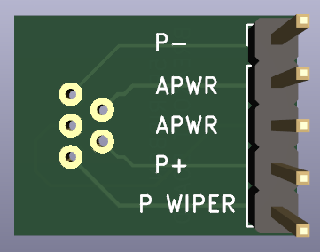

# PQ12-P Breakout Board

This project contains a KiCad schematic and layout for an **Actuonix PQ12-P** breakout board.

## Assembly
  - [HLW5R-2C7LF connector](https://www.digikey.com/en/products/detail/amphenol-icc-fci/HLW5R-2C7LF/1002131) (left)
  - 0.1" header pins (right)

## 3D Render

